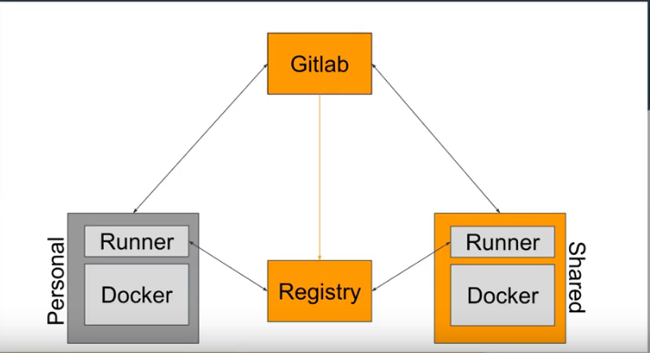

# Gitlab for CI/CD

### High level architecture.


### Requirements
- Gitlab Project
- Docker Container Engine

### Introduction
The gitlab application for CI / CD is based on two important parts, that is, the `pipeline` will follow the instructions of the `.gitlab-ci.yml` file and the `runner` is the environment where the pipeline will be executed, this can be a local server or a docker container.

In addition, it is supported by a `registry` whose main objective is to store the images that the pipeline must construct when executed.

### Gitlab Runner with Docker
The first step is download the image from docker hub repository to use `gitlab-runner`:

```shell
$ docker pull gitlab-runner
```
Now, we need to mount a config volume into the `gitlab-runner` to be used for configs and other resources:
```shell
$ docker run -d --name gitlab-runner --restart always \
   -v /srv/gitlab-runner/config:/etc/gitlab-runner \
   -v /var/run/docker.sock:/var/run/docker.sock \
   gitlab/gitlab-runner:latest
```
Once the configuration is ready, we run the `runner`:
```shell
$ docker run -d --name gitlab-runner --restart always \
     -v /var/run/docker.sock:/var/run/docker.sock \
     --volumes-from gitlab-runner-config \
     gitlab/gitlab-runner:latest
```

### Register the `runner`.
To register a `runner` using a Docker Container Engine:
```shell
$ docker run --rm -t -i -v /srv/gitlab-runner/config:/etc/gitlab-runner gitlab/gitlab-runner register
```
Enter your GitLab instance URL:
```shell
 Please enter the gitlab-ci coordinator URL (e.g. https://gitlab.com )
 https://gitlab.com
```
Enter the token you obtained from the GitLab Project in `CI/CD Settings -> Runners` (expand options). To register the `runner`:
```shell
 Please enter the gitlab-ci token for this runner
 xxxzzzxxxzzz
```
Enter a description for the `runner`, you can change this later in GitLab’s UI:
```shell
 Please enter the gitlab-ci description for this runner
 [hostame] my-runner
```
Enter the tags associated with the `runner`, you can change this later in GitLab’s UI:
```shell
 Please enter the gitlab-ci tags for this runner (comma separated):
 my-tag,another-tag
```
Enter the `runner` executor:
```shell
 Please enter the executor: ssh, docker+machine, docker-ssh+machine, kubernetes, docker, parallels, virtualbox, docker-ssh, shell:
 docker
```
You’ll be asked for the default image to be used for projects that do not define one in `.gitlab-ci.yml`:
```shell
 Please enter the Docker image (eg. ruby:2.1):
 node:9
```
### Create demo application.


