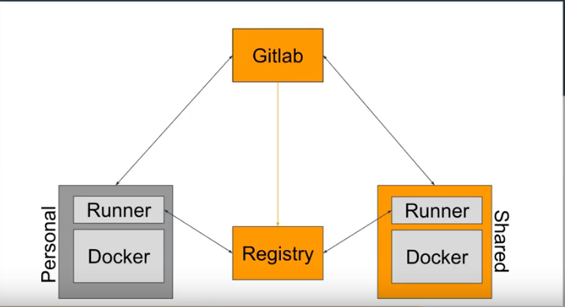

# Gitlab for CI/CD

### 1. High level architecture.

### 2. Gitlab Runner.

### 3. Gitlab Registry.

### 4. Create demo application.

### 5. CI/CD using plain `ssh` (Not dockerized approach).

### 6. CI/CD using `runner shell executor`.

### 7. CI/CD using `runner docker executor`.

